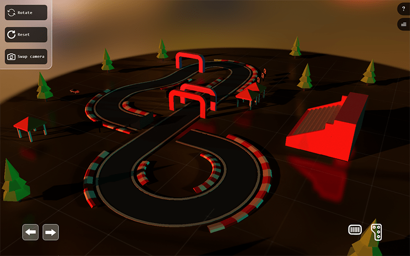
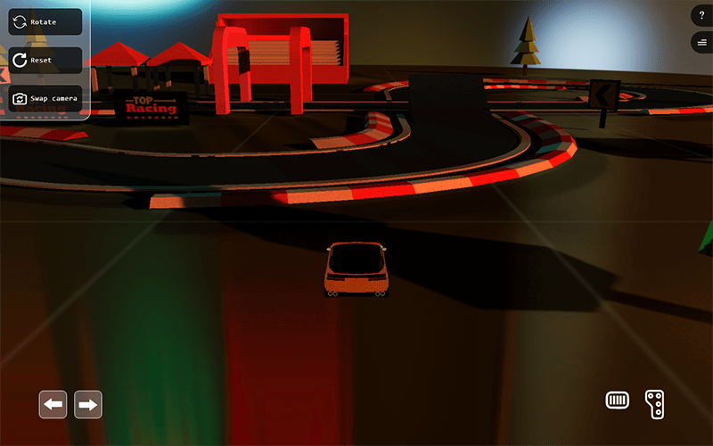
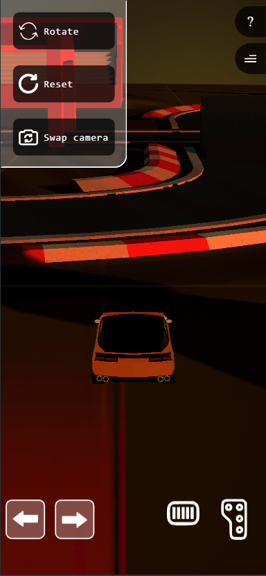

# 🏎️ Car game

### This game offers a captivating and dynamic visual experience for users, and thanks to its responsive design, it runs smoothly on all devices. In this game, you enter a meticulously designed 3D world. The use of three.js allows you to create complex 3D models and realistic environments, while react-three-fiber helps you seamlessly integrate these elements into a React environment. One of the standout features of this game is its responsiveness. No matter whether you are using a smartphone, tablet, or personal computer, you can enjoy the game. The responsive design ensures that the game's graphical elements and user interface automatically adjust to the size of your screen, providing an optimized and enjoyable gaming experience at all times. This game is not only visually stunning but also technically advanced. The combination of three.js and react-three-fiber allows developers to leverage the strengths of both technologies to create a dynamic and engaging 3D game that also performs well. Overall, this game is a great example of how modern web technologies can be used to create exciting and immersive gaming experiences.

## Link 🔗 [https://charactermi.github.io/car-game](https://charactermi.github.io/car-game)

 

# Preview

 

# Mobile Responsive

# Technologies

 

<ul>
    <li>
        
    </li>
    <li>
        
    </li>
    <li>
        
    </li>
    <li>
        
    </li>
    <li>
        
    </li>
    <li>
        
    </li>
</ul>
